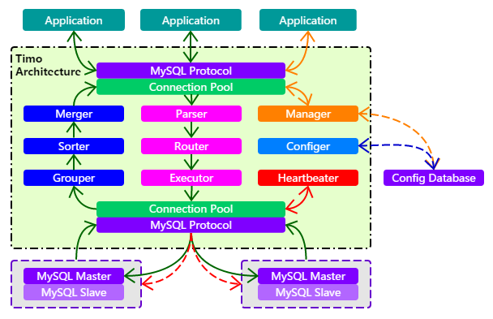

# Timo 的结构

## Timo的代码架构

Timo的具体架构如下图所示：



## Timo的包结构

```java
src                                    
 ├─main                                
 │  ├─java                              -- Timo-server主程序           
 │  │  └─fm                                            
 │  │      └─liu                                       
 │  │          └─timo                                  
 │  │              ├─backend               -- 数据源和数据节点       
 │  │              ├─config                -- 配置信息       
 │  │              │  ├─loader                -- 配置信息加载       
 │  │              │  ├─model                 -- 配置信息模型       
 │  │              │  └─util                  -- 配置信息工具       
 │  │              ├─exception             -- 异常信息       
 │  │              ├─heartbeat             -- 心跳检测       
 │  │              ├─manager               -- 管理端口连接       
 │  │              │  ├─handler               -- 管理命令处理     
 │  │              │  ├─parser                -- 管理命令解析      
 │  │              │  └─response              -- 管理命令应答      
 │  │              ├─merger                -- 数据结果集合并       
 │  │              ├─mysql                 -- MySQL工具类       
 │  │              │  ├─connection            -- MySQL连接       
 │  │              │  ├─handler               -- MySQL数据包处理       
 │  │              │  └─packet                -- MySQL数据包       
 │  │              ├─net                   -- 网络服务器       
 │  │              │  ├─buffer                -- 缓冲池       
 │  │              │  ├─connection            -- 连接和连接变量       
 │  │              │  ├─factory               -- 连接工厂类       
 │  │              │  └─handler               -- 连接命令处理       
 │  │              ├─route                 -- 路由解析       
 │  │              │  ├─function              -- 拆分函数       
 │  │              │  └─visitor               -- 语法树解析器       
 │  │              ├─server                -- 服务端口连接       
 │  │              │  ├─handler               -- SQL命令处理       
 │  │              │  ├─parser                -- SQL命令解析       
 │  │              │  ├─response              -- SQL命令应答       
 │  │              │  └─session               -- 会话       
 │  │              │      └─handler              -- 会话处理器       
 │  │              ├─statistic             -- SQL统计       
 │  │              └─util                  -- 通用工具类       
 │  ├─parser                            -- MySQL语法解析器            
 │  │  └─fm                            
 │  │      └─liu                        
 │  │          └─timo                  
 │  │              └─parser                -- 语法解析器
 │  │                  ├─ast                  -- 语法树结构模块
 │  │                  .            
 │  │                  .
 │  │                  .
 │  │                  ├─recognizer           -- 语法树分析器    
 │  │                  │  └─mysql                -- MySQL保留字
 │  │                  │      ├─lexer               -- 词法分析
 │  │                  │      └─syntax              -- 句法分析
 │  │                  ├─util                 -- 通用工具类    
 │  │                  └─visitor              -- 语法树遍历器
 │  └─resources                        
```